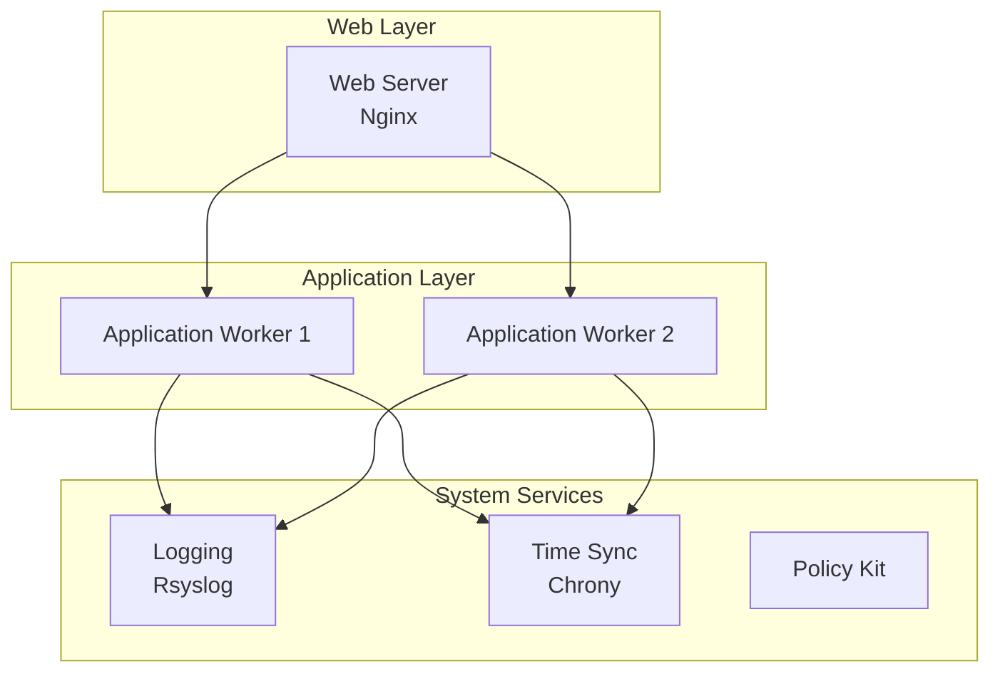
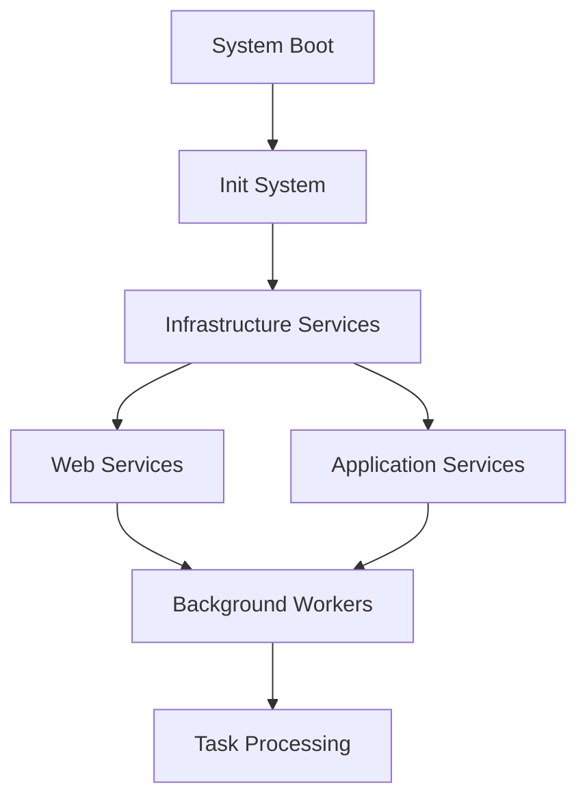
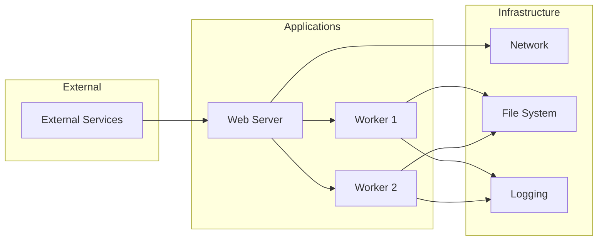
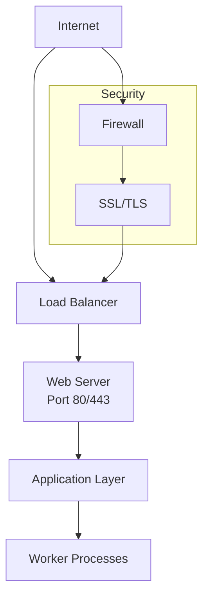
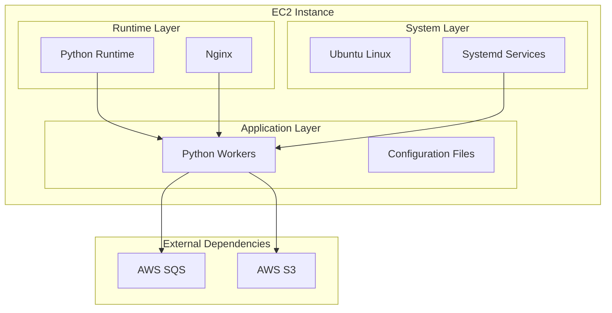

# Infrastructure Diagrams

## System Architecture Diagram

## Process Flow Diagram

## Service Dependency Diagram

## Network Topology

## Deployment Architecture

---

*Diagrams generated by InfraDoc 2.0*  
*Last updated: 2025-06-23 17:15:24*
