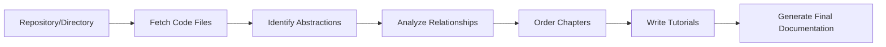

# Dosu-2: Multi-Agent Code Intelligence System

> **A comprehensive appendable agent for Dosu.dev's AI agent capabilities for automated code understanding, documentation generation, and knowledge management**

## 🎯 Project Overview

**Dosu-2** is an experimental multi-module system that demonstrates the core capabilities of [Dosu.dev](https://dosu.dev) - the AI agent that helps with code maintenance, documentation, and knowledge sharing. This project showcases three independent but interconnected modules that work together to provide comprehensive code intelligence.

### What is Dosu.dev?

Dosu is an AI agent that lives in GitHub repositories, helping teams with:
- **24/7 Issue Resolution**: Automatically responds to issues, triages bugs, and provides solutions
- **Documentation Automation**: Generates and maintains up-to-date documentation from code
- **Knowledge Management**: Creates searchable knowledge bases from codebases, conversations, and tickets
- **Multi-language Support**: Responds in users' native languages within minutes
- **Code Intelligence**: Understands code relationships and provides contextual assistance

### Project Philosophy

Following Dosu's tagline **"You build, Dosu documents"**, this system automates the knowledge capture and documentation process, allowing developers to focus on building while the system handles knowledge management automatically.

---

## 🏗️ System Architecture

The system consists of three main modules, each addressing different aspects of code intelligence:


---

## 📚 Module 1: Codebase Understanding

**Location**: `codebase-understanding/`

This module analyzes GitHub repositories or local codebases to automatically generate beginner-friendly tutorials and documentation.

### 🔧 Core Features

- **Intelligent Code Analysis**: Uses Tree-sitter for robust AST parsing
- **Abstraction Identification**: Discovers key concepts and patterns in codebases
- **Relationship Mapping**: Analyzes how different code components interact
- **Tutorial Generation**: Creates step-by-step learning materials
- **Multi-language Support**: Generates documentation in different languages

### 🔄 Processing Pipeline



### 🚀 Quick Start

```bash
# Analyze a GitHub repository
python codebase-understanding/main.py --repo https://github.com/example/repo --token YOUR_GITHUB_TOKEN

# Analyze a local directory  
python codebase-understanding/main.py --dir /path/to/project

# Generate in different language
python codebase-understanding/main.py --repo https://github.com/example/repo --language spanish

# Limit abstractions and customize output
python codebase-understanding/main.py --repo https://github.com/example/repo --max-abstractions 15 --output ./my-docs
```

### ⚙️ Configuration Options

| Parameter | Description | Default |
|-----------|-------------|---------|
| `--repo` | GitHub repository URL | - |
| `--dir` | Local directory path | - |
| `--output` | Output directory | `./output` |
| `--language` | Tutorial language | `english` |
| `--max-abstractions` | Max concepts to identify | `10` |
| `--include` | File patterns to include | Common code files |
| `--exclude` | File patterns to exclude | Test/build directories |
| `--no-cache` | Disable LLM caching | Caching enabled |

### 🎯 Use Cases

- **Developer Onboarding**: Generate comprehensive tutorials for new team members
- **Documentation Automation**: Keep documentation synchronized with code changes
- **Code Understanding**: Quickly grasp complex codebases through structured explanations
- **Educational Content**: Create learning materials for open-source projects

---

## 🔍 Module 2: Agentic Web Search

**Location**: `dosu-agentic_web_search/`

An AI-powered content curation system that plans, searches, extracts, and organizes web resources with intelligent browser automation.

### 🔧 Core Features

- **Intelligent Search Strategy**: AI plans optimal search queries for comprehensive coverage
- **Browser Automation**: Uses browser-use agents for dynamic content extraction
- **Process Monitoring**: Implements timeouts and process management for reliability
- **Content Curation**: AI filters and ranks content by relevance and quality
- **Parallel Crawling**: Efficient content retrieval with rate limiting

### 🔄 Processing Pipeline


### 🚀 Quick Start

```bash
# Start content curation
python dosu-agentic_web_search/content_curator_agent.py course_requirements.json

# Resume existing session
python dosu-agentic_web_search/content_curator_agent.py course_requirements.json --session-id abc123

# Auto-approve all URLs (skip manual review)
python dosu-agentic_web_search/content_curator_agent.py course_requirements.json --auto-approve
```

### 📋 Course Requirements Format

```json
{
  "course_requirements": {
    "training_prompt": "LangGraph end-to-end: setup, integration, security, best practices",
    "job_description": "Building scalable agentic AI applications using LangChain",
    "timeframe_hours": 40,
    "include_web_search": true
  },
  "web_search_instructions": {
    "target_content": "comprehensive documentation, tutorials, implementation patterns"
  }
}
```

### 🎯 Use Cases

- **Training Content Creation**: Curate comprehensive learning materials for specific technologies
- **Documentation Discovery**: Find and organize scattered documentation across the web
- **Research Automation**: Systematically collect information on technical topics
- **Content Quality Assurance**: AI-driven filtering ensures high-quality, relevant resources

---

## 📊 Module 3: Knowledge Base

**Location**: `dosu-knowledge-base/`

Advanced code analysis system that creates searchable knowledge graphs from Python codebases using AST analysis and Neo4j graph databases.

### 🔧 Core Features

- **Advanced AST Analysis**: Tree-sitter parsing with intelligent fallbacks
- **Code Intelligence**: Function calls, inheritance, and dependency mapping
- **Graph Database Storage**: Neo4j integration with vector embeddings
- **Semantic Search**: Vector similarity for finding related code
- **Relationship Mapping**: Comprehensive code entity relationships

### 🔄 Processing Pipeline


### 🚀 Quick Start

```bash
# Analyze repository and create knowledge graph
python dosu-knowledge-base/ast_analyzer.py --repo https://github.com/langchain-ai/langchain

# Analyze local directory
python dosu-knowledge-base/ast_analyzer.py --local /path/to/project

# Import into Neo4j with embeddings
python dosu-knowledge-base/knowledge_graph_generator.py --input analysis.json --embeddings openai

# Run smoke tests
python dosu-knowledge-base/ast_analyzer.py --smoke-test
```

### 🗄️ Database Schema

The system creates a rich graph schema in Neo4j:

```cypher
// Node Types
(:Function {name, complexity, is_async, parameters, embedding})
(:Class {name, methods, base_classes, embedding})
(:File {path, name, extension})
(:Module {name})
(:Parameter {name, position})

// Relationship Types
(Function)-[:CALLS]->(Function)
(Class)-[:INHERITS]->(Class)
(Function)-[:BELONGS_TO]->(Class)
(Function)-[:DEFINED_IN]->(File)
(File)-[:IMPORTS]->(Module)
```

### 🎯 Use Cases

- **Code Navigation**: Quickly understand code structure and dependencies
- **Impact Analysis**: Trace function calls and inheritance hierarchies
- **Similar Code Discovery**: Find code with similar functionality using embeddings
- **Architecture Visualization**: Generate comprehensive codebase overviews

---

## 🛠️ Setup & Installation

### Prerequisites

```bash
# Python 3.10+
python --version

# Required for all modules
pip install -r requirements.txt

# Additional dependencies for specific modules
pip install tree-sitter tree-sitter-python  # For better AST parsing
pip install neo4j sentence-transformers     # For knowledge graphs
pip install browser-use crawl4ai            # For web search
```

### Environment Variables

Create a `.env` file in the project root:

```bash
# LLM Providers (choose one)
OPENAI_API_KEY=your_openai_key_here
GEMINI_API_KEY=your_gemini_key_here

# Web Search
BRAVE_API_KEY=your_brave_search_key

# Neo4j Database (for knowledge graphs)
NEO4J_URI=neo4j+s://your-instance.databases.neo4j.io
NEO4J_USERNAME=neo4j
NEO4J_PASSWORD=your_password
NEO4J_DATABASE=neo4j

# GitHub (for repository access)
GITHUB_TOKEN=your_github_token
```

### Quick Setup Script

```bash
#!/bin/bash
# setup.sh

# Install Python dependencies
pip install -r requirements.txt

# Install optional dependencies
pip install tree-sitter tree-sitter-python neo4j sentence-transformers browser-use crawl4ai

# Create output directories
mkdir -p output
mkdir -p curated_content
mkdir -p logs

echo "Setup complete! Configure your .env file with API keys."
```

---

## 🚀 End-to-End Workflow

Here's how to use all three modules together for comprehensive code intelligence:

### Step 1: Analyze Codebase Structure
```bash
python codebase-understanding/main.py --repo https://github.com/target/repo
```

### Step 2: Curate Related Learning Materials
```bash
python dosu-agentic_web_search/content_curator_agent.py course_requirements.json
```

### Step 3: Build Knowledge Graph
```bash
python dosu-knowledge-base/ast_analyzer.py --repo https://github.com/target/repo
python dosu-knowledge-base/knowledge_graph_generator.py --input analysis.json
```

---
## 📈 Performance & Scalability

### Optimization Features

- **Caching**: LLM response caching to reduce API costs and improve speed
- **Batch Processing**: Efficient handling of large codebases
- **Rate Limiting**: Token-per-minute limiting for API compliance
- **Parallel Processing**: Concurrent operations where possible
- **Progress Tracking**: Real-time progress indicators for long operations

### Resource Usage

| Module | Memory Usage | Processing Time | API Calls |
|--------|-------------|----------------|-----------|
| Codebase Understanding | 500MB-2GB | 5-10 min | 5-10 |
| Web Search | 1-3GB | 5-10 min | 10-50 |
| Knowledge Base | 200MB-1GB | 2-5 min | 2-5 |

---

## 🧪 Testing & Validation

### Smoke Tests

Each module includes comprehensive smoke tests:

```bash
# Test codebase understanding
python codebase-understanding/main.py --repo https://github.com/simple/repo --max-abstractions 3

# Test web search
python dosu-agentic_web_search/web_search_adapter.py

# Test knowledge base
python dosu-knowledge-base/ast_analyzer.py --smoke-test
```

### Quality Metrics

- **Documentation Coverage**: Percentage of code elements documented
- **Relationship Accuracy**: Correctness of identified code relationships  
- **Content Relevance**: Quality score of curated web content
- **Processing Success Rate**: Percentage of files successfully processed

---

## 🔮 Roadmap & Future Enhancements

### Planned Features

1. **Real-time Monitoring**: Live codebase change detection and documentation updates
2. **Multi-language Support**: Extend beyond Python to JavaScript, Go, Java, etc.
3. **Integration APIs**: REST APIs for seamless integration with existing tools
4. **Advanced Analytics**: Code quality metrics and trend analysis
5. **Collaborative Features**: Team-based knowledge sharing and annotation

### Dosu.dev Alignment

This project demonstrates understanding of Dosu's core value propositions:
- **Automated Knowledge Management**: No manual documentation maintenance
- **Intelligent Code Understanding**: Deep analysis of code relationships
- **Multi-modal Learning**: Combining code analysis with web research
- **Scalable Architecture**: Designed for large codebases and teams

---

## 🎯 What I Want to Build at Dosu Next

Having demonstrated core code intelligence capabilities with this project, here are two major initiatives I'd love to drive at Dosu to extend its reach and impact:

### 🔧 Initiative 1: InfraDoc Agent
*Extending Dosu from repository intelligence to live infrastructure documentation*

#### The Vision
An AI-powered tool that connects to real, deployed infrastructure via SSH, auto-discovers services, and generates up-to-date documentation and architecture maps — especially in complex, multi-cloud environments.

#### 🧠 Problem Statement
Current Dosu works brilliantly at the repository level, but real-world teams face infrastructure documentation challenges:
- **Outdated docs** — teams never update Confluence or Notion when infrastructure changes
- **Lack of visibility** — multi-cloud, multi-VM setups are impossible to track manually
- **Onboarding pain** — new developers don't know what's running where
- **Debugging friction** — root cause analysis is hard when infrastructure isn't documented

**Dosu doesn't handle this today** — it works from repo-level intelligence. InfraDoc Agent extends Dosu's scope to deployed systems.

#### 🧱 System Architecture


**Core Components:**

1. **User Input Interface**
   - CLI or Web UI for configuration
   - Accepts: IPs/hostnames, SSH credentials, metadata (cloud provider, regions)

2. **Connection Manager**
   - Secure SSH session management
   - Parallel workers for multiple machines
   - Stateless design with optional encrypted storage

3. **Service Scanner** (per machine)
   - `ps aux` → running processes
   - `netstat -tuln` → open ports  
   - `docker ps, docker inspect` → containerized services
   - Config file analysis (nginx.conf, .env, /etc configs)
   - Tech stack identification (Django, Node, Redis, PostgreSQL)

4. **Topology Mapper**
   - AI-powered inference of service communication
   - Maps database connections and API dependencies
   - Identifies external service integrations

5. **AI Doc Generator**
   - LLM-powered architecture documentation
   - Mermaid/PlantUML diagram generation
   - Integration with existing Dosu knowledge base

#### 🧪 Real-World Example

**Given Infrastructure:**
- 2 EC2 instances (Node.js app + Redis)
- 1 DigitalOcean Droplet (Django API)
- 1 GCP VM (PostgreSQL database)
- VPN connectivity between environments

**InfraDoc Agent Discovery:**
- Node app on :3000 → calls Redis :6379 + Django :8000
- Django .env → points to PostgreSQL on GCP IP
- Inferred 3-tier architecture with external database

**Generated Output:**
- `architecture.md` with comprehensive service descriptions
- `infrastructure-diagram.mmd` with visual topology
- `service-dependencies.json` for programmatic access
- Integration with existing Dosu documentation

#### 🚀 Why Dosu Needs This

- **Live Infrastructure Context**: Enhances Dosu's repository intelligence with deployment reality
- **Enhanced Bug Triage**: See exactly where affected services are running
- **Enterprise Value**: Critical for large organizations with complex infrastructure
- **Market Differentiation**: No other code intelligence platform offers infra-aware AI

#### 🔐 Security & Compliance

- Read-only SSH access (never writes to servers)
- In-memory processing with optional ephemeral mode
- Audit logging for all infrastructure access
- Supports air-gapped and private cloud deployments

---

### 🏢 Initiative 2: Enterprise-Grade Everywhere
*Making Dosu deployment-ready for highly regulated industries*

#### The Opportunity
While Dosu excels in open-source and tech-forward companies, massive market opportunities exist in:
- **Financial Services** (banks, fintech, trading firms)
- **Healthcare** (hospitals, pharma, medical device companies)  
- **Government** (federal agencies, defense contractors, municipalities)
- **Enterprise** (Fortune 500 with strict compliance requirements)

#### 🔧 Technical Requirements

**Self-Hosted & Private Cloud**
- Kubernetes-native deployment with Helm charts
- Docker containers for easy on-premise installation
- Air-gapped network support (no external API calls)
- Private cloud compatibility (AWS GovCloud, Azure Government)

**Fine-Tuned Self-Deployable Models**
- Custom LLM endpoints (Azure OpenAI, AWS Bedrock, local models)
- Organization-specific fine-tuning on internal codebases
- Offline inference capabilities for sensitive environments
- Support for specialized models (code-specific, domain-specific)

**Enterprise Security & Compliance**
- **SOC 2 Type II** compliance certification
- **Fine-grained RBAC** (role-based access control)
- **Comprehensive audit logs** for all actions and decisions
- **Data residency controls** (keep data within specific regions/clouds)
- **SSO integration** (SAML, LDAP, Active Directory)
- **Encryption at rest and in transit** (FIPS 140-2 compliance)

#### 📊 Market Impact

| Industry | Key Value Proposition | Compliance Needs |
|----------|----------------------|------------------|
| **Financial** | Automated code documentation for trading systems, risk management | SOC 2, PCI DSS, SEC regulations |
| **Healthcare** | HIPAA-compliant documentation for medical software | HIPAA, FDA 21 CFR Part 11 |
| **Government** | Secure code intelligence for mission-critical systems | FedRAMP, FISMA, NIST frameworks |
| **Enterprise** | Scalable documentation across global development teams | SOC 2, ISO 27001, custom policies |

#### 🚀 Implementation Strategy

**Phase 1: Foundation**
- Self-hosted deployment options
- Basic RBAC and audit logging
- Custom LLM endpoint support

**Phase 2: Compliance**
- SOC 2 Type II certification process
- Advanced security controls
- Industry-specific compliance packages

**Phase 3: Specialization**
- Industry-specific fine-tuned models
- Vertical market go-to-market strategy
- Enterprise customer success programs

#### 💡 Competitive Advantage

This positions Dosu as the **only AI code intelligence platform** that can serve:
- **Open source communities** (current strength)
- **Enterprise development teams** (new market)
- **Highly regulated industries** (untapped opportunity)

No competitor offers this breadth of deployment options with AI-powered code understanding.

---

## 🤝 Contributing

This project serves as a demonstration of modern AI agent capabilities for code intelligence. Key areas for contribution:

1. **Module Extensions**: Add support for new programming languages
2. **Integration Connectors**: Build plugins for popular development tools
3. **Performance Optimizations**: Improve processing speed and resource usage
4. **Quality Improvements**: Enhance accuracy of code analysis and content curation

---

## 📄 License

MIT License - See LICENSE file for details.

---

## 🙏 Acknowledgments

- **Dosu.dev Team**: For creating the inspiring AI agent that guided this project's vision
- **PocketFlow**: For the modular workflow framework enabling flexible processing pipelines
- **Tree-sitter**: For robust, cross-language code parsing capabilities
- **Neo4j**: For graph database technology enabling code relationship visualization

---

*Built with ❤️ as a demonstration of AI-powered code intelligence capabilities inspired by Dosu.dev*

--Praveen